

# BME-515-Project

## Authors: Braden Garrison, Rocio Rodriguez, Shane Beyer

## Due: 4/27/22

## Introduction

Migraines are listed by the American Migraine Foundation as the third most common
disease, and among the top ten most disabling medical illnesses in the world. Cefaly Dual is a
transcutaneous trigeminal nerve stimulator marketed as an over-the-counter (OTC) acute and
preventative migraine treatment option. It was approved as a Class II OTC device by the FDA in
2020 via the 510(k) clearance process. The device consists of a bipolar, self-adhesive electrode
and a pulse generator that magnetically attaches to the electrode which allows for user-controlled
stimulation amplitude. Cefaly claims the Cefaly Dual treats migraines through stimulation of the
trigeminal nerve, reportedly via “segmental ‘gate control’ mechanisms.” Gate control theory
asserts that activation of non-nociceptive sensory neurons engages inhibitory interneurons in the
dorsal horn, thus closing the “gate” for transmission of painful, nociceptive signals. Aß fibers
are larger diameter, sensory neurons that transmit non-nociceptive signals, which in theory
“block” nociceptive signals from smaller diameter A∂ fibers.

A series of computational studies by Salkim et al. analyzing the Cefaly device cited that
50% of a large population of Cefaly users were not satisfied with their results. They attributed
this dissatisfaction to neuroanatomical differences in the targeted trigeminal nerve branches,
specifically the supraorbital nerve (SON) and supratrochlear nerve (STN). They modeled the
Cefaly device to determine if different locations of the SON resulted in significant current
threshold differences and therefore differences in percent fiber activation. Using the McIntyre-
Richardson-Grill (MRG) model and modeling 4 SON trajectories and 1 STN trajectory, they
found a current range of 6 mA to 26 mA was required to activate all Aß fibers in all variations.
This far exceeds the maximum Cefaly current of 16 mA, indicating these neuroanatomical
variations could be the cause of inefficacy in some users.

Salkim et al. only analyzed Aß fiber activation and arbitrarily equated treatment efficacy
with 50% fiber activation, not considering the effects of A∂ fiber activation on the proposed gate
control mechanism. Our model aims to analyze the efficacy of the Cefaly device by investigating
the impact of neuroanatomical variations on both Aß and A∂ fiber activation in four SON
variations and one branched STN variation.

## Methods

To gain insight into the supposed nerve fiber activation of the Cefaly device, we
developed a computational biophysical model in NEURON implementing the McIntyre-
Richardson-Grill double-cable myelinated axon model **(Figure 1)**. 
This model has been validated for the modeling of myelinated, peripheral axons in mammals for fiber diameters within the Aß
fiber range, ranging from 5.7 μm to 16 μm. Our model only investigates the excitability of Aß
fiber diameters within the range of axon diameters found in the ophthalmic nerve, the root of the
SON and STN, which is 5.7 μm to 15 μm. To model smaller diameter A∂ fibers, we
interpolated fiber geometrical parameters using equations acquired from Dr. Edgar Peña of the
Grill Lab at Duke University **(Equation 1)**. 

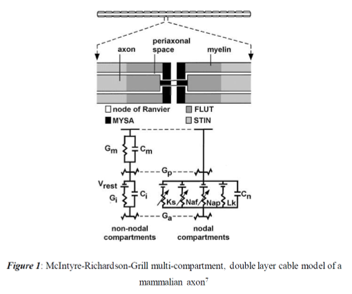

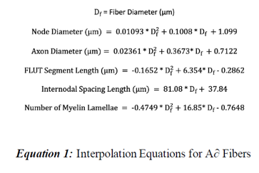

It is important to note this method has not yet been extensively validated
experimentally, yet we believe it to be a sufficient approximation of A∂ fiber geometry and
suitable for our analysis. Although a therapeutically effective ratio of activation hasn’t been
identified, it is believed that sufficient activation of A∂ fibers could lead to enough pain signal
transmission that causes the “pain gate” to open and cause an individual to still feel pain.
Our model implements the Cefaly electrode geometry as two point-current sources
separated by an interelectrode spacing of 13 mm centered on the midline of the forehead. We
derived the four SON locations and one STN location from data collected from two cadaveric
studies listed in our references. These four SON groupings exemplify average anatomical differences
between individuals. The STN was modeled as two separate branches, a lateral (STN-L) and
a medial (STN-M) branch, to ensure proper investigation of A∂ fiber activation due to the close
proximity of this nerve to the midline. We assumed all nerves to have vertical trajectories and
calculated the exact electrode to fiber distances relative to each nerve’s protrusion through the
frontalis muscle into the subcutaneous layer. This allowed us to more accurately model a
homogeneous extracellular medium with a constant resistivity value of 0.00043 S/mm for skin.

The Cefaly Dual stimulation parameters of a biphasic pulse with pulse width 250 μs were
used to investigate fiber activation **(Figure 5)**. The current threshold amplitude was found for
each fiber diameter in each nerve, but the maximum Cefaly current amplitude of 16 mA was
considered for analysis of the model results. We calculated percent activation of fibers to
determine the overall ratio of Aß to A∂ fiber activation. We assumed the same Gaussian
distribution of Aß fibers as Salkim et al. with a mean of 11.5 μm and standard deviation of 1.9
μm. We used the histometric analysis reference density plot to assume a Gaussian
distribution of A∂ fibers with a mean of 3.5 μm and standard deviation of 0.75 μm. For
simplicity, we also assumed an equal distribution of fiber types between the STN and SON.

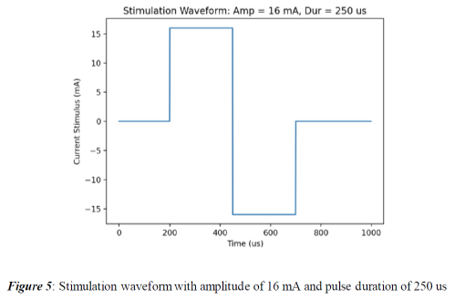

## Modeling Results and Analysis

We first assessed the relationship between fiber diameter, electrode-to-fiber distance and
activation threshold for the representative range of diameters of Aß fibers: 5.7 μm – 15 μm.
**Figure 6** shows the activation thresholds across this range of Aß fiber diameters for
STN-M and STN-L. Both branches exhibit activation thresholds that are inversely proportional
to the square root of the fiber diameter, as expected from prior literature. Larger diameter axons have larger internodal spacing which creates larger
transmembrane voltage changes than fibers with smaller internodal spacing.
The STN-M branch exhibits a less pronounced inverse exponential decline in thresholds
with respect to diameter because it is closer to the electrodes; current thresholds also depend on
the distance between the stimulating electrodes and the nerve fiber. The activation thresholds are on average three
times higher for the STN-L compared to the STN-M; this can be explained by the STN-M being
much closer to the midline of the forehead, where the electrodes would be placed on the user.
Current-distance effects are observed to be stronger than current-diameter effects, so it is
intuitive that fiber diameter has less of an effect on current threshold for the STN-M branch as
these effects are overpowered by a small electrode-to-fiber distance. Additionally, all fiber
diameters within this range are activated at thresholds within the working range of the Cefaly
Dual device. The highest threshold was found to be 10.5 mA for the 5.7 μm fibers in the STN-L.
As this current is lower than 16 mA, we can conclude that 100% of Aß fibers in the STN-M and
STN-L would be activated using a current amplitude within the Cefaly Dual range.

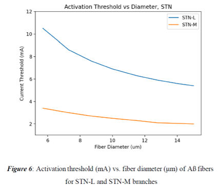

We then investigated the current-diameter and current-distance relationships for four
different trajectories of the SON nerve. These four groups varied in horizontal distance from the
midline of the forehead, with SON1 as the closest to the midline and SON4 as the furthest, as
shown in **Table 2**. **Figure 7** shows the activation thresholds across the same range of
Aß fiber diameters for SON groups; SON variations exhibit even more pronounced inverse
exponential relationships between current thresholds and fiber diameters as they are much farther
from the electrodes than the STN branches. The largest range of threshold currents across
diameters in the SON trajectories is 15 mA on average compared to 5.1 mA in the STN
branches. Current-diameter effects thus become much more prominent at larger distances away
from the electrodes. To further bolster this conclusion, the difference in threshold currents across
the SON trajectories is minimal. The highest average difference in threshold currents is 0.42 mA,
between SON2 and SON3. The salient difference in this analysis is the effect of a larger
electrode-to-fiber distance on current thresholds between the STN and SON. In contrast to 100%
of STN branch nerve fiber activation below 16 mA, the average percent activation of fibers
across the SON placements was 82.12%. Thus, a significant amount of smaller diameter Aß
fibers will not be activated using the highest current parameter available to Cefaly Dual users.

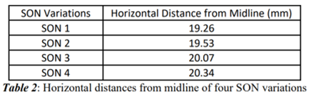

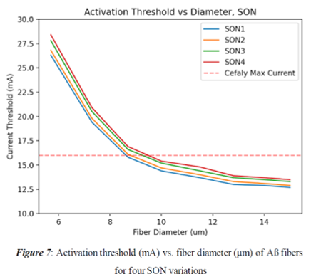

Next, we performed the same analysis for the representative range of diameters of A∂
fibers: 1 μm – 5 μm. **Figure 8** shows the activation thresholds across this range of A∂
fiber diameters for the STN-M and STN-L branches. We observed similar inverse exponential
relationships between fiber diameter and current thresholds to those found in Aß fibers for the
STN branches. The STN-M also shows a less pronounced inverse exponential relationship to that
of the STN-L, in a parallel fashion to our observations of Aß fibers. The key difference between
Aß and A∂ fibers in the STN branches is the level of activation compared to the 16 mA current
limit. While 100% of A∂ fibers in the STN-M branch are activated below 16 mA, only 20.23%
of A∂ fibers in the STN-L are activated. Most A∂ fibers in the further STN-L branch require
much greater currents to reach threshold than the larger Aß fibers. Thus, 100% of both the
unintended nociceptive A∂ fibers are activated in addition to the targeted non-nociceptive Aß
fibers in the STN-M branch. Although a much smaller fraction of A∂ fibers are activated in the
STN-L branch in comparison to Aß fibers at the max current limit, these activations are still
worrisome for the effectiveness of the proposed gate control mechanism for treating migraine as
well as for pain at the site of stimulation. We found 0% activation of A delta fibers in all SON
groupings for 16 mA and below, so we have chosen not to plot their thresholds as they are not
relevant to the analysis of this device.

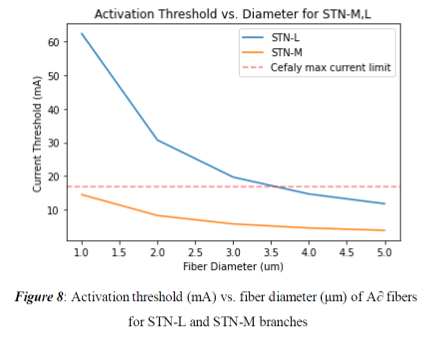

Our final analysis consisted of calculating percent fiber activations with respect to
stimulus current level for each fiber type in each branch. We then calculated ratios of Aß fiber
activation to A∂ fiber activation at different current levels. **Figure 9** shows the percent fiber
activation for Aß fibers as a function of stimulus current level. Both STN branches show steep
activation curves as responses to small increases in stimulus current and saturate quickly. STNM
is activated first and saturates the fastest as it is the closest to the electrode. Although shifted
to higher thresholds, STN-L activates at a similar rate for the first 6 points, then it saturates at a
slightly lower rate as it is further from the electrodes than STN-M. The four SON groups also
have much higher current thresholds and take higher currents to saturate as they are much further
from the stimulating electrodes than the STN branches. We can clearly see from this plot that Aß
fiber activation is much more affected by electrode-to-fiber distance than fiber diameter
differences in this range. Our results are in line with the trends in fiber activation for each nerve
branch as shown in the results from Salkim et al.

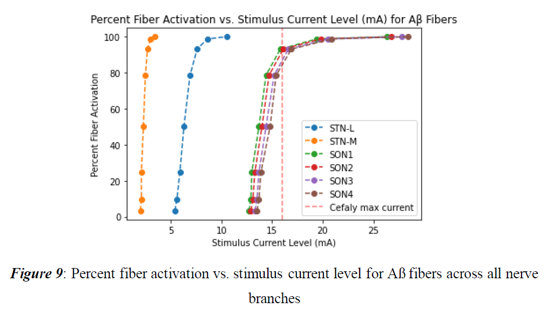

**Figure 10** shows the percent activation versus stimulus current of A∂ fibers in the STN-M
and STN-L branches. There is a clear tradeoff between activation of Aß fibers and A∂ fibers
as the stimulus current increases. As shown in **Table 5**, we calculated percent fiber activations
for both fiber types for the maximum current setting on the device, 16 mA, as well as what we
determined as a more optimal current setting, 14.4 mA. This current level was chosen to
maximize the amount of Aß fiber activation while minimizing the amount of A∂ fiber activation
according to our percent activation plots in **Figures 8 and 9**. As shown in **Table 6**, we calculated
the ratio of Aß fiber activation to A∂ activation using 16 mA stimulus current for each
combination of STN branches with an SON grouping. We then calculated the activation ratios
using 14.4 mA for each combination of STN branches with an SON grouping. The highest
activation ratio using 16 mA is 2.44, compared to the highest activation ratio of 2.79 using 14.4
mA. Prolonged stimulation can result in Aß fiber adaptation such that A∂ fiber activation has an
increased relative effect. Thus, we can assume that the overall therapeutic effect would decrease
over the course of the 60-minute treatment. These ratios don’t provide indisputable evidence for
gate control theory and suggest pain at the site of stimulation. We also found that the current
level to activate 0% total A∂ fibers total, 3.8 mA, would not activate any Aß fibers within SON
trajectories, STN-L, and 100% of the Aß fibers in the STN-M. This current setting would only
activate 33.3% of total Aß fibers in all branches we’ve considered, which we do not believe is
therapeutically reasonable due to the potency of pain signals and other effects such as central sensitization.

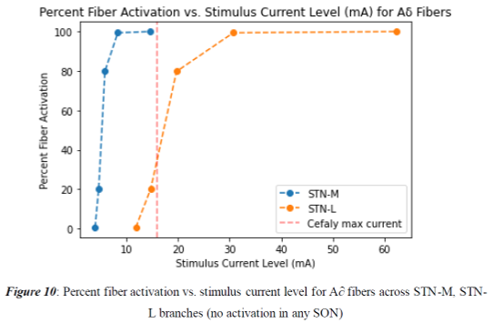

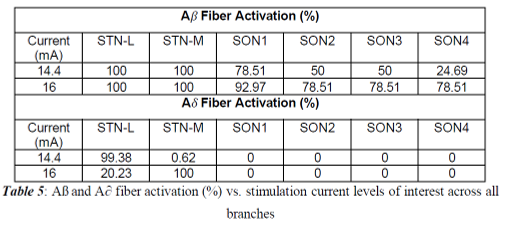

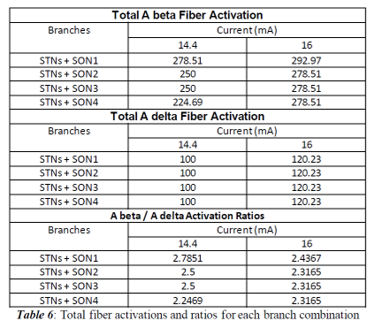

## Conclusion

Our biophysical model indicates a questionably low ratio of Aß to A∂ fiber activation, raising
concerns over the proposed gate control theory mechanism of action. Significant A∂ fiber
activation was seen in the STN-M across all therapeutically reasonable stimulus ranges,
indicating users would likely feel pain at the sites of stimulation. This provides further evidence
for claims that a significant amount of users are unsatisfied with Cefaly. Based on these data, as well
as the market analysis data presented in the full report (Beyer_Garrison_Rodriguez.pdf), we are not 
convinced of the claimed therapeutic effects of Cefaly Dual and would not move to acquire this technology. 
All our references and additional figures can be found in the full report as well, including in-text citations 
where appropriate.